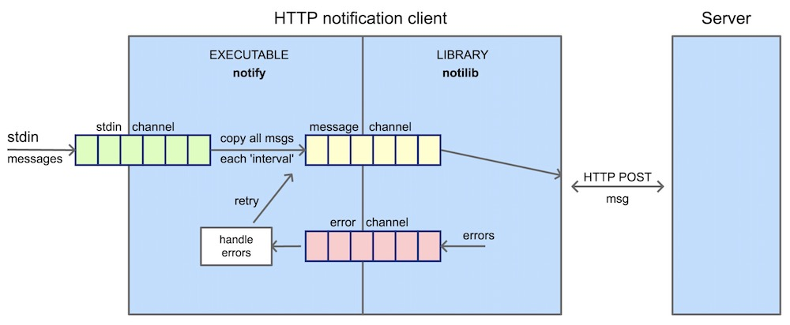

# Go Test Task `Notifier` 

HTTP notification client implemented in Golang for sending messages read from the stdin and forward them to the URL configured via an HTTP POST method.

It has 2 main components: 

- The library `notilib` responsible for sending notifications to a provided URL. More details [here](./notilib/README.md).
- The executable `notify` that uses the library `notilib` for sending notifications read from the stdin. More details [here](./notify/README.md).

Moreover, we have added a test server for receiving the notifications. More details [here](./server/README.md).

