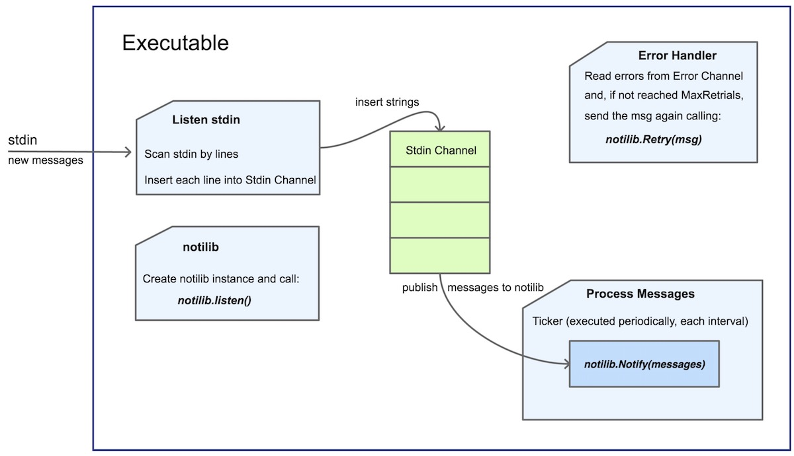

#  Notify





## Installation
Execute the following commands from a terminal to install the `notify` executable:

``` bash
$ cd notify
$ go install
```


### Help 
``` bash
$ notify
usage: notify --url=URL [<flags>]

Flags:
        --help                  Shows context-sensitive help
        -i, --interval=5s       Notification interval
        -c, --chcap=500         Channel capacity for reading from stdin
        -r, --retrials=2        Maximal number of retrials when receives an error sending a notification
        -m, --messages=100      Maximal number of messages to be processed per interval
```


``` bash
$ notify --help
Usage of notify:
  -c int
        Channel capacity for reading from stdin (shorthand) (default 500)
  -chcap int
        Channel capacity for reading from stdin (default 500)
  -i duration
        Notification interval (shorthand) (default 5s)
  -interval duration
        Notification interval (default 5s)
  -m int
        Maximal number of messages to be processed per interval (shorthand) (default 100)
  -messages int
        Maximal number of messages to be processed per interval (default 100)
  -r int
        Maximal number of retrials when receives an error sending a notification (shorthand) (default 2)
  -retrials int
        Maximal number of retrials when receives an error sending a notification (default 2)
  -u string
        URL where to send notifications (shorthand)
  -url string
        URL where to send notifications
```

## Usage
To execute the `notify` program, at least we have to provide the mandatory flag `url` with the URL where to send the notifications using HTTP POST method:
```bash
$ notify --url=http://localhost:9090/api/notifications 
INFO[2019-04-08T21:30:16+02:00] HTTP Notification client started. Listening for new messages from stdin... 
```

We could also use the flags for changing the default configuration values:

```bash
$ notify --url=http://localhost:9090/api/notifications --loglevel=debug --interval=10s --chcap=100 --retrials=5 --messages=50
INFO[2019-04-08T21:29:19+02:00] HTTP Notification client started. Listening for new messages from stdin... 
DEBU[2019-04-08T21:29:19+02:00] Notify configuration: 
{
  url: "http://localhost:9090/api/notifications",
  interval: "10s",
  channelCapacity: 100,
  maxNumRetrials: 5,
  maxNumMessagesToProcess: 50,
}
 
DEBU[2019-04-08T21:29:19+02:00] Notilib configuration: 
{
  BurstLimit: 1000,
  NumMessagesPerSecond: 1000,
  MsgChanCap: 1000,
  ErrChanCap: 500,
  LogLevel: debug,
}
```