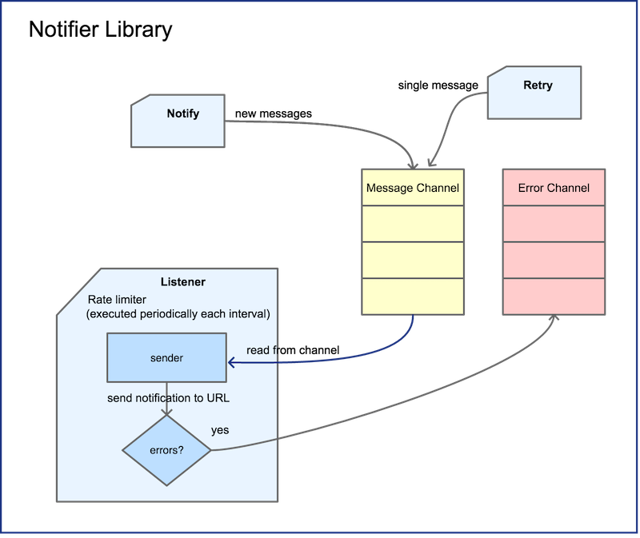

# notilib

`notilib` is a library that implements an HTTP notification client. Once configured the URL in the constructor, all notifications will be sent there.

The client of this library uses the method `Notify` for adding new messages to be sent, they are first buffered in the `Message Channel` before being sent to the URL. It is an asynchronous operation so the client will not wait until the message is sent.

At a predefined interval, the library reads the content of the `Message Channel` and sends it to the URL provided using an HTTP POST method.

Notilib exposes the `Error Channel` for reporting those messages that has failed and give the oportunity to the client to handle those errors. One mechanism could be retry sending the message, for this purpose the `Retry` method is available.



## Usage

### Constructor

First we need to contruct a `notilib` entity using the `New` method:
```go
func New(url string, client *http.Client, conf *Config) (Notilib, error) 
```

where `client` is an optional parameter, by default `http.DefaultClient`.

`conf` is also an optional parameter. These are its fields:
```go
type Config struct {
	BurstLimit           int       // Burst limit for the listener, allowing to process several messages from the Message Channel per rate
	NumMessagesPerSecond int       // Maximal number of messages to be processed per second (it will be used to calculate the rate for the rate limiter)
	MsgChanCap           int       // Message Channel Capacity
	ErrChanCap           int       // Error Channel Capacity
	LogLevel             log.Level // log level for logrus
}
```

and these are its default values:
```go
const defaultMsgChCap = 1000
const defaultErrChCap = 500
const defaultBurstLimit = 1000
const defaultNumMessagesPerSecond = 1000
const defaultLogLevel = log.InfoLevel
```

Here is an example:
```go
conf := &Config{ 
    MsgChanCap: 100, 
    ErrChanCap: 2, 
    LogLevel: log.DebugLevel,
    NumMessagesPerSecond: 10,
    BurstLimit: 50, 
}

client := &http.Client{
    Timeout: time.Second * 10,
}

notilib, err = notilib.New(url, client, conf)
if err != nil {
    log.Errorf("unable to start the client: %v", err)
    return
}
```


### Start service

Once we have the `notilib` instance, we are ready to listen to the `Message Channel` for new incoming notifications to be forwarded:
```go
notilib.Listen()
```

### Send notifications

Now we can send notifications to be sent to the URL:
```go
guid, err := notilib.Notify(messages)
if err != nil {
    log.Errorf("notifier client has reported a failure: %v", err)
}
```
this returns a `GUID` assigned to all the messages and useful to track errors from the `Error Channel`, this ID has this format `0e527ed5-45a3-4c48-8b96-6fdc709da90d`.

## Components

### Notifier
The `notifier` converts the slice of strings passed as input parameter of method `Notify` to a `message` struct and insert them into the `Message Channel`. It is like a buffering, all notifications are stored in the `Message Channel` pending to be processed by the listener.

```go
type message struct {
	content     string // notification text message
	guid        string // GUID: Unique identifier
	index       int    // Index of the message from the []string passed as parameter to the notilib.Notify method
	numRetrials int    // Current number of retrials for this notification
}
```
When calling `Notify`, all the messages from the slice will have the same `guid` but different `index`.

### Listener
The `listener` is responsible for reading the messages from the `Message Channel` and pass them to the `sender` calling `sender.send(msg)`. This process uses a rate limiter to avoid exceeding the server rate limit.

### Sender
The `sender` is initialized with the URL where all notifications have to be sent.

When calling `sender.send(msg)`, it transforms the `message` struct passed as input parameter into an `*http.Request`, setting the HTTP method to POST, and pass the resulting request to the client handler.

The sender is also responsible for checking the HTTP Code of the response and if it is different than `200 OK` or `201 Created`, it will publish a new `NError` into the `Error Channel`.


### Client Handler
The client handler is responsible for sending over the network the notifications to the specified URL. 

We could call directly the function `http.Client.Do(http.Request)` but for testing purposes we have created the client handler since it allows us to mock the call `Do(req *http.Request) (*http.Response, error)`.

### Retrialer
The `retrialer` is responsible for inserting the `message` struct of a failed notification into the `Message Channel` increasing the `numRetrials` by one.


## Testing

```bash
$ cd notilib
$ go test -v
=== RUN   TestDispatch
=== RUN   TestDispatch/Positive_TC
--- PASS: TestDispatch (0.00s)
    --- PASS: TestDispatch/Positive_TC (0.00s)
=== RUN   TestListen
=== RUN   TestListen/Positive_TC
=== RUN   TestListen/Negative_TC:_nil_request_channel
=== RUN   TestListen/Negative_TC:_nil_sender
--- PASS: TestListen (2.00s)
    --- PASS: TestListen/Positive_TC (2.00s)
    --- PASS: TestListen/Negative_TC:_nil_request_channel (0.00s)
    --- PASS: TestListen/Negative_TC:_nil_sender (0.00s)
=== RUN   TestNotify
=== RUN   TestNotify/Positive_TC
=== RUN   TestNotify/Nil_message_channel
--- PASS: TestNotify (1.00s)
    --- PASS: TestNotify/Positive_TC (1.00s)
    --- PASS: TestNotify/Nil_message_channel (0.00s)
=== RUN   TestNew
=== RUN   TestNew/Positive_TC:_default_config
=== RUN   TestNew/Positive_TC:_custom_config
=== RUN   TestNew/Missing_URL
=== RUN   TestNew/Invalid_URL
--- PASS: TestNew (0.00s)
    --- PASS: TestNew/Positive_TC:_default_config (0.00s)
    --- PASS: TestNew/Positive_TC:_custom_config (0.00s)
    --- PASS: TestNew/Missing_URL (0.00s)
    --- PASS: TestNew/Invalid_URL (0.00s)
=== RUN   TestRetry
=== RUN   TestRetry/Positive_TC
WARN[2019-04-08T16:45:25+02:00] Retrial[2]: { GUID : "1234", Index : 4, Content : "hello world" } 
=== RUN   TestRetry/Nil_message_channel
--- PASS: TestRetry (1.00s)
    --- PASS: TestRetry/Positive_TC (1.00s)
    --- PASS: TestRetry/Nil_message_channel (0.00s)
=== RUN   TestSend
=== RUN   TestSend/Positive_TC
=== RUN   TestSend/Negative_TC:_context_done_before_send
=== RUN   TestSend/Negative_TC:_context_done_after_send
--- PASS: TestSend (6.01s)
    --- PASS: TestSend/Positive_TC (2.00s)
    --- PASS: TestSend/Negative_TC:_context_done_before_send (2.00s)
    --- PASS: TestSend/Negative_TC:_context_done_after_send (2.00s)
PASS
ok      github.com/daniel-gil/notifications-client/notilib      10.032s 
```
